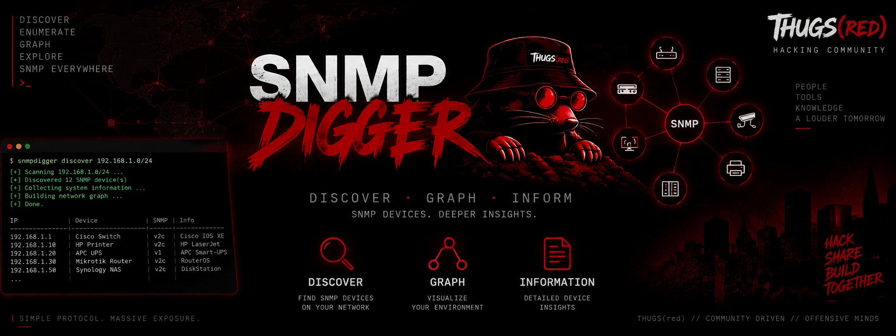
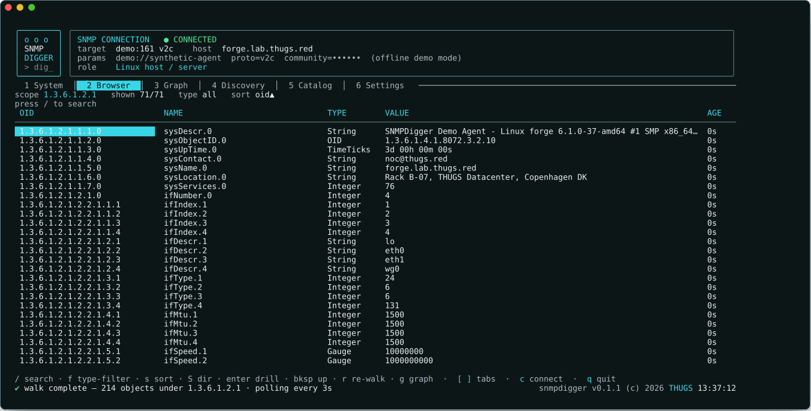
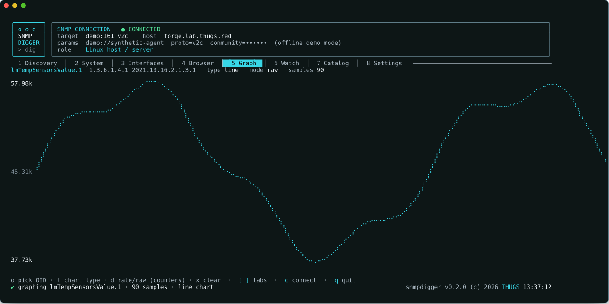
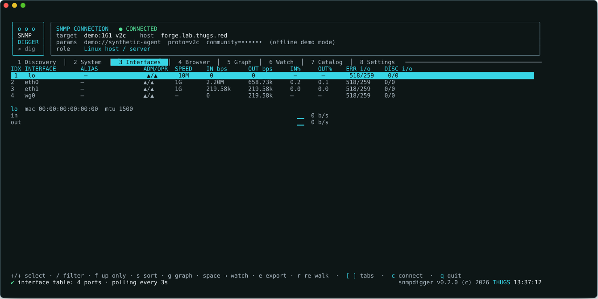
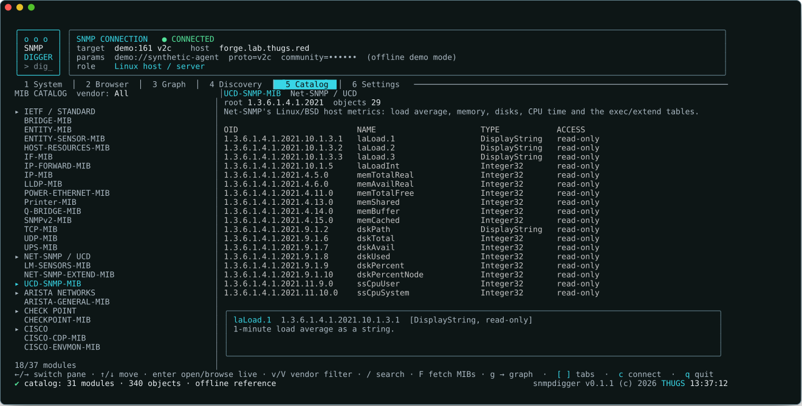
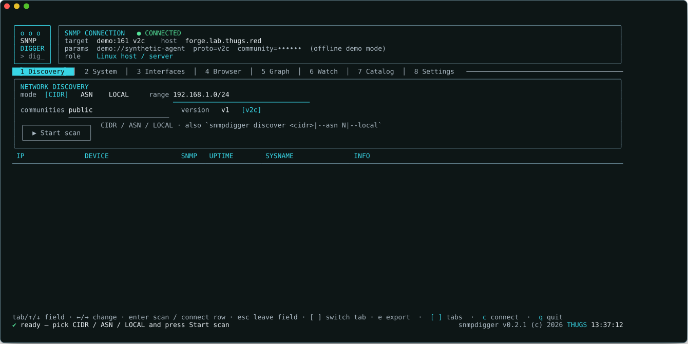
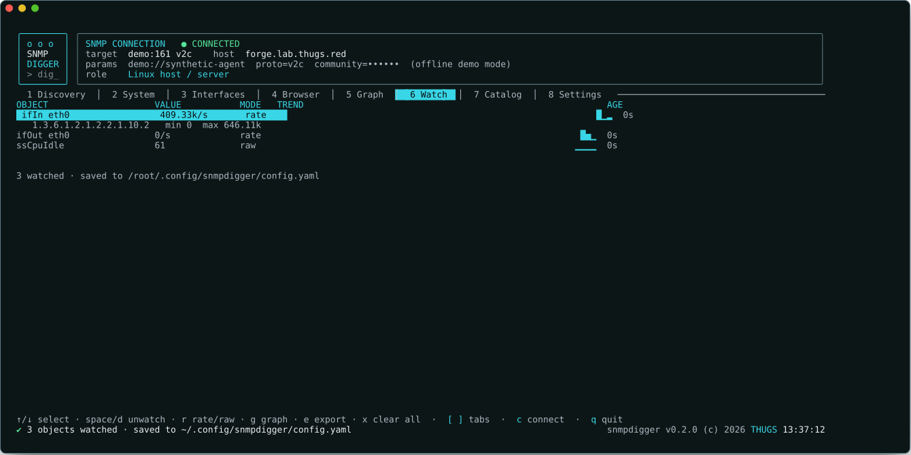
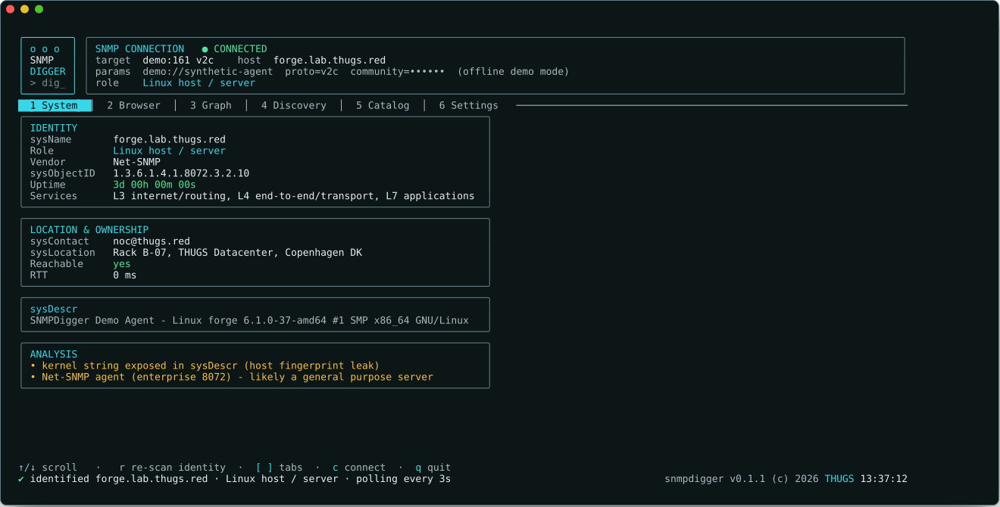

<p align="center">
  
</p>

<h1 align="center">snmpdigger</h1>

<p align="center">
  <em>DISCOVER &middot; GRAPH &middot; INFORM — SNMP devices. Deeper insights.</em><br>
  <em>A fully keyboard-driven terminal UI that walks, identifies, graphs and hunts SNMP agents.</em><br>
  <a href="https://github.com/kawaiipantsu/snmpdigger"><strong>github.com/kawaiipantsu/snmpdigger</strong></a>
</p>

<p align="center">
  
  
  
  
  
  
</p>

---

Run `snmpdigger` with no arguments and it boots straight into a full-screen TUI:
a square terminal-window logo top-left, an extended-width header that keeps the
live connection string in view, a tab bar, and a one-line footer with a spinner,
progress bars and a ticking clock. It opens on the **Discovery** tab — nothing is
forced, so you can scan a range or browse the offline MIB catalog before you
connect to anything. Press `c` (or pick a discovered host) for the connection
dialog — host, port, **v1 / v2c / v3**, community string or the whole v3
user / security-level / auth / priv credential set — or run with `--demo` and the
app talks to a synthetic agent so you can wander the entire interface with no
device on the wire.

From there: it **walks** the MIB tree and lets you browse every object by
numeric OID *and* human name, live-polling values every 1–5 seconds. It
**identifies** what it is talking to — vendor from the enterprise number, device
role, decoded OSI service layers, and an analysis panel that calls out an empty
`sysContact` or a kernel string leaking through `sysDescr`. It **graphs** any
counter or gauge live as a braille line chart, bars, a sparkline, a gauge, a
huge big-number readout or a heatmap. And it **discovers** — point it at a CIDR
range and it sweeps the network for anything that answers SNMP.

> **SIMPLE PROTOCOL. MASSIVE EXPOSURE.**

<p align="center">
  <code>snmpdigger</code> &nbsp;|&nbsp; <code>snmpdigger --demo</code> &nbsp;|&nbsp; <code>snmpdigger discover 192.168.1.0/24</code>
</p>

<p align="center">
  
  
</p>
<p align="center">
  
  
</p>
<p align="center">
  
  
</p>

## What's in the box

| | |
|---|---|
| **Boot** | no args &rarr; alt-screen TUI, opening on the Discovery tab — the connection dialog is never forced. `c` opens it (pre-filled from a discovered row); `--demo` swaps in a synthetic live agent, no device required. |
| **System** | pulls the system group and *fingerprints* the host: vendor from the `sysObjectID` enterprise number, best-effort role (Cisco / MikroTik / Juniper / Fortinet / printer / UPS / NAS / hypervisor / Linux / Windows / …), decoded `sysServices` OSI layers, uptime, `sysContact` / `sysLocation` / admin — plus an analysis panel flagging missing contacts and fingerprint leaks. Live-updates. |
| **Interfaces** | a live **IF-MIB dashboard** — every port with `ifName` / alias, admin+oper status, speed, **in/out bit/s** and **% utilisation** (computed from HC counters), plus error and discard deltas; the selected port gets in/out sparklines. `/` filter &middot; `f` up-only &middot; `s` sort (index / name / utilisation / errors) &middot; `g` graph it &middot; `space` pin it to Watch &middot; `e` export the table to CSV. |
| **Browser** | walks the MIB/OID tree on connect; table of **numeric OID + human name + type + value + age**, polled every 1–5 s. `/` fuzzy search &middot; `f` filter by type &middot; `s` sort &middot; `enter` drill &middot; `backspace` up &middot; `g` graph &middot; `space` watch &middot; `e` export. |
| **Graph** | pick any numeric OID, watch it live. Chart types: **line** (braille), **bars**, **sparkline**, **gauge**, huge **big-number**, **heatmap**. `t` cycles type &middot; `d` toggles raw vs per-second rate for counters &middot; `o` opens a fuzzy object picker. |
| **Watch** | a pin-board of objects gathered from anywhere in the app (`space`). Each shows its live value, per-second rate, a sparkline and min/max; the list is **persisted to the config** so it survives restarts. `r` raw↔rate &middot; `g` graph &middot; `e` export. |
| **Discovery** | the default landing tab. Sweep by **CIDR**, by **AS number** (`ASN` mode resolves every announced IPv4 prefix via RIPEstat and scans them all), or **LOCAL** (this host's private interface networks plus the common LAN /24s). Each address gets a **fast liveness probe** (one tiny GET, ~400 ms, no retries) and only responders get a full identify pass — a /24 finishes in well under a second, a /16 in a minute or so — and hits **appear in the table as they're found**, not at the end. Multi-range sweeps are streamed and cancellable; `enter` on a row opens the connection dialog **pre-filled**; `e` exports. Head-less too: `snmpdigger discover 192.168.1.0/24 \| --asn AS13335 \| --local`. |
| **Catalog** | an offline reference of known MIB modules and their notable objects — the full IETF/standard set (SNMPv2-MIB, IF-MIB, IP/TCP/UDP-MIB, HOST-RESOURCES-MIB, ENTITY-MIB, BRIDGE/Q-BRIDGE, LLDP, UPS-MIB, Printer-MIB…) plus the big firewall and network vendors (Cisco, Juniper, MikroTik, Fortinet, Palo Alto, Check Point, SonicWall, Sophos, WatchGuard, Arista, HPE/Aruba, Huawei, Nokia, Extreme). Browse by vendor, search across everything, `enter` to walk that subtree on the live device or `g` to graph it. Fetch additional vendor MIBs on demand into `~/.config/snmpdigger/mibs`. |
| **Settings** | poll interval, timeouts, retries, GETBULK tuning, graph history depth, theme (`thugs` light-grey/cyan/dark · `ember` · `matrix` · `mono`), default walk scope, secret masking. Persisted to `~/.config/snmpdigger/config.yaml` (XDG-aware). |
| **CLI** | `discover` (`--asn` / `--local` / `--max-hosts`) &middot; `walk` &middot; `get` &middot; `monitor` (a scriptable `watch` for SNMP, `--interval` / `--delta`) &middot; `identify` &middot; `config path\|show` &middot; `version`. Shared flags: `--community`, `--version v1\|v2c\|v3`, `--port`, `--demo`, and the v3 set `--user --level --auth-proto --auth-pass --priv-proto --priv-pass --context`. |
| **Under it** | **Go 1.27**, `CGO_ENABLED=0`, one static binary. TUI on [Bubble Tea](https://github.com/charmbracelet/bubbletea) / Bubbles / Lipgloss; SNMP via [gosnmp](https://github.com/gosnmp/gosnmp). Zero runtime deps — net-snmp's `snmptranslate` is *optional* and only used to enrich MIB names when present. |

## Quick start

```bash
git clone https://github.com/kawaiipantsu/snmpdigger.git && cd snmpdigger
make build

./bin/snmpdigger --demo     # kick the tyres with a synthetic agent, no device needed
./bin/snmpdigger            # for real — opens on Discovery; press c to connect
```

Head-less, straight from the shell:

```bash
snmpdigger discover 192.168.1.0/24
snmpdigger discover --local --communities public,private   # your LANs
snmpdigger discover --asn AS13335 --json                   # everything an AS announces
snmpdigger identify 10.0.0.1 --community public
snmpdigger walk 10.0.0.1 1.3.6.1.2.1.2.2                   # ifTable
snmpdigger monitor 10.0.0.1 1.3.6.1.2.1.2.2.1.10.2 --delta # per-second, like watch(1)
snmpdigger walk 10.0.0.1 --version v3 --user monitor \
  --level authPriv --auth-proto SHA --auth-pass '***' \
  --priv-proto AES --priv-pass '***'
```

Shared flags: `--community` &middot; `--version v1|v2c|v3` &middot; `--port` &middot; `--demo`,
plus the v3 set `--user --level --auth-proto --auth-pass --priv-proto --priv-pass --context`.

### Packages

```bash
make cross            # linux/amd64, linux/386, linux/armhf, linux/arm64  -> dist/
make deb              # .deb for all four arches via dpkg-deb             -> dist/deb/
make dist             # cross + deb + SHA256SUMS

sudo make install                 # /usr/local/bin/snmpdigger
sudo dpkg -i dist/deb/*.deb        # or the Debian way
```

## How it works

One Bubble Tea model owns the screen. A poll ticker fires on your configured
interval and issues SNMP `GET`s for exactly the OIDs the active tab cares about;
the Browser walk and the Discovery sweep run as cancellable background jobs that
stream progress back into the footer. MIB names resolve from a built-in table of
the standard trees, with `snmptranslate` consulted only for the leftovers.
Charts are hand-rolled — braille rasterisation for the line chart, block-glyph
columns for bars and heatmap, a 5-row block font for the big-number readout — so
there is nothing to render but text.

The chrome is fixed: a square terminal-window logo top-left, an extended-width
connection header top-right (target, identified host, decoded role), the tab bar,
the active view, and a one-line footer — live status and progress on the left,
`snmpdigger <version> (c) 2026 ` + **THUGS** + a ticking clock on the right.

<p align="center">
  
</p>

## Layout

```
main.go                  entry point: no args -> TUI, else CLI dispatch
internal/
  cli/                   head-less subcommands (discover · walk · get · identify · …)
  config/                ~/.config/snmpdigger/config.yaml load/save (XDG-aware)
  mib/                   OID <-> name resolver: built-in tree + optional snmptranslate
  snmp/                  gosnmp transport, walk/get, system-group identify, CIDR sweep
  tui/                   Bubble Tea model, chrome, tabs and the five views
  tui/charts/            braille line · bars · sparkline · gauge · big-number · heatmap
packaging/               Debian control template, man page, copyright
assets/                  banner + brand art
Makefile                 build · cross · deb · dist · install
```

## Docs

[Overview](docs/overview.md) &middot;
[Keys &amp; hotkeys](docs/keys.md) &middot;
[CLI reference](docs/cli.md) &middot;
[Build &amp; packaging](docs/build.md)

## License

MIT — see [LICENSE](LICENSE).

<p align="center"><sub>built for <a href="https://thugs.red">thugs.red</a> &middot; SIMPLE PROTOCOL. MASSIVE EXPOSURE.</sub></p>
